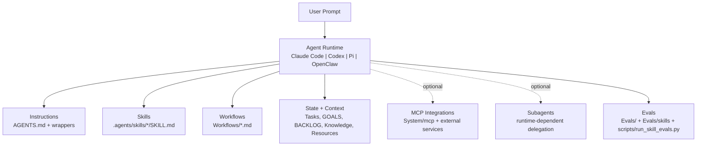

# Personal OS


Your agentic personal operating system, built to automate high-leverage workflows with Claude Code, Codex, Pi, OpenClaw, and other coding agents and runtime platforms.

---

## Quick Start

1. **Clone this repo**
   ```bash
   git clone https://github.com/itseffi/personal-os.git
   cd personal-os
   ```

2. **Run setup**
   ```bash
   chmod +x setup.sh
   ./setup.sh
   ```

3. **Start using**
   ```
   Open this repo in your agent and run:
   1) "Process my backlog from BACKLOG.md into Tasks/**/*.md using AGENTS.md rules."
   2) "Show my P0/P1 unblocked tasks aligned to GOALS.md."
   3) "Propose today’s top 3 with required verification evidence and commands."
   ```

---

## Agent Compatibility

This repo is designed to work with Claude Code, Codex, Pi, and OpenClaw.

- Shared behavior: `AGENTS.md`
- Claude wrapper: `CLAUDE.md`
- Codex wrapper: `CODEX.md`
- Pi wrapper: `PI.md`
- OpenClaw wrapper: `OPENCLAW.md`
- Canonical runtime skills: `.agents/skills/*/SKILL.md`
- Skills in this repo follow the [Agent Skills open standard](https://agentskills.io/home).
- This repo uses skills with progressive disclosure to manage context efficiently: agents begin with each skill's metadata (`name`, `description`, file path, plus `agents/openai.yaml`), and load full `SKILL.md` instructions only when a skill is selected. Canonical skills live in `.agents/skills/`, with bridge paths for Claude, Pi, and OpenClaw.
- Optional subagents are supported when the runtime provides agent delegation features (not required for core repo operation).
- Claude bridge path: `.claude/skills -> ../.agents/skills` (symlink)
- Pi bridge: configure Pi to point to this repo and use `.agents/skills/` as its skill source
- OpenClaw bridge: create `skills -> .agents/skills` symlink (or load `.agents/skills` via OpenClaw config)

Bridge bootstrap (run once from repo root):

```bash
mkdir -p .claude
ln -sfn ../.agents/skills .claude/skills
ln -sfn .agents/skills skills
```

For Codex/OpenAI-style routing metadata, this repo includes:
- `.agents/skills/<skill>/agents/openai.yaml`
  (Claude, Pi, and OpenClaw primarily use `SKILL.md` and do not require this file format.)

---

## Architecture



## Pi Local/Offline Setup (Optional)

You can run this repo with a fully local Pi + local model setup on Mac, no API keys required.

### 1) Start a local model server

```bash
brew install llama.cpp
llama-server \
  -hf unsloth/GLM-4.7-Flash-GGUF:UD-Q4_K_XL \
  --jinja \
  --temp 0.7 --top-p 1.0 --min-p 0.01 \
  --repeat-penalty 1.0 --fit on \
  --port 8080
```

This exposes an OpenAI-compatible endpoint at `http://localhost:8080/v1`.

### 2) Connect Pi to that server

```bash
npm install -g @mariozechner/pi-coding-agent
```

Create `~/.pi/agent/models.json`:

```json
{
  "providers": {
    "llama-cpp": {
      "baseUrl": "http://localhost:8080/v1",
      "api": "openai-completions",
      "apiKey": "none",
      "models": [{ "id": "GLM-4.7-Flash" }]
    }
  }
}
```

Run:

```bash
pi
```

Then open this workspace and use canonical skills from `.agents/skills/`.
See [Pi Agent Setup](Tutorials/pi-agent-setup.md) for repo-specific usage.

---

## What's Inside

```
personal-os/
├── AGENTS.md           # AI agent instructions (the brain)
├── GOALS.md            # Your goals and priorities
├── BACKLOG.md          # Quick capture inbox
├── Tasks/              # Your active work
├── Knowledge/          # Your notes and docs
├── Resources/          # Voice samples, templates, references
├── Workflows/          # Daily + Product & Strategy workflows
├── .agents/skills/     # Canonical Codex/OpenAI skill packs
├── Evals/              # Session reviews
├── Tutorials/          # Learning guides
└── System/             # MCP server, templates, integrations
```

---

## Key Features

### **AI Memory**
Your agent remembers your preferences, goals, and working style across sessions through structured markdown files.

### **Task Management**
- YAML frontmatter for metadata
- Priority levels (P0-P3)
- Status tracking
- Goal alignment

### **Workflows**
- Daily standup (pick your focus)
- Backlog processing (turn notes into tasks)
- Weekly reviews (reflect on progress)
- Wrap-up protocol (document completed work)
- Product & strategy pipelines (research, decisions, assumptions, opportunity mapping, stakeholder politics)

### **Skills**
- Planning (brainstorming, hypothesis design, writing plans)
- Building (TDD, verification)
- Analysis (debugging, root cause, MECE, problem structuring)
- Research (JTBD, assumptions, experiments, opportunity solution tree, OST intake and target selection)
- Decisions (decision journal, DAVCI, reversibility)
- Strategy (crux diagnosis, competitor analysis, structured strategy, limit-based strategy, value-chain mapping)
- Meetings (IDEAS summary, hidden agendas, influence, meeting power-dynamics)
- Stakeholders (power map, difficult conversations, stakeholder risk review, framing/comms, executive update review, challenge questions)
- Guardrails (think-before-coding, simplicity-first, surgical changes, goal-driven execution)

---

## How It Works

### The Memory Stack

```
AGENTS.md        →    Instructions layer (how AI behaves)
GOALS.md         →    Priority layer (what matters)
Tasks/**/*.md     →    State layer (current work)
Knowledge/**/*.md →    Context layer (reference)
.agents/skills/* →    Capability layer (how the agent executes specialized workflows)
```

### Semantics by Location

Where a file lives tells the AI what it *is*:
- `Tasks/fix-bug.md` → Actionable work
- `Knowledge/fix-bug.md` → Documentation
- Files use YAML frontmatter for metadata

### Privacy First

Most personal operating data stays local (gitignored):
- `Tasks/` - your work
- `Knowledge/` - your notes
- `Resources/` - your samples
- `BACKLOG.md` - your inbox

Some top-level configuration files (`AGENTS.md`, `GOALS.md`, `CLAUDE.md`, `CODEX.md`, `PI.md`, `OPENCLAW.md`, docs) are version controlled by design. Treat `GOALS.md` as potentially sensitive and review content before publishing a public repo.

---

## Example Usage

**Daily**
```
"What should I work on today?"
```

**Capture ideas:**
```
Add to BACKLOG.md, then: "Process my backlog"
```

**Build something:**
```
"Let's brainstorm a new feature for [idea]"
"Create a spec for [feature]"
"Create a plan from this spec"
```

**Weekly:**
```
"Run weekly review"
```

---

## Documentation

- [Build Your Personal OS](Tutorials/build-your-personal-os.md) - Complete guide
- [Memory & Context](Tutorials/memory.md) - How agents remember
- [Workflows](Workflows/README.md) - Daily + product/strategy workflows
- [Canonical Skills](.agents/skills/README.md) - Runtime skill packaging and sync workflow
- [Pi Agent Setup](Tutorials/pi-agent-setup.md) - Use this repo with Pi
- [OpenClaw Setup](Tutorials/openclaw-setup.md) - Use this repo with OpenClaw
- [Tutorials](Tutorials/README.md) - All learning guides

---

## Tech Stack

- **File Format:** Markdown with YAML frontmatter
- **AI Agent:** Claude Code, Codex, Pi, OpenClaw, Cursor, or any coding agent
- **Optional:** MCP integrations (Slack, Linear, Calendar, Atlassian, Granola)
- **Version Control:** Git

---

## Evals

This repo includes both structural and behavioral evals for skills.

Run:

```bash
python scripts/validate_skills.py
python scripts/validate_skill_eval_cases.py
python scripts/run_skill_evals.py --provider fixture
```

Optional live-model run (OpenAI-compatible endpoint, local or remote):

```bash
python scripts/run_skill_evals.py --provider openai --model your-model-id
```

Outputs are written to:

- `Evals/skills/results/`

Use these evals as a regression gate when updating `.agents/skills/`.

---

## Long-Running Agent Principles

This project follows three patterns from OpenAI guidance:
- **Skills**: versioned procedures in `.agents/skills/*/SKILL.md`
- **Shell execution**: run real tasks in terminal environments and produce artifacts
- **Compaction-aware workflows**: structure long runs to preserve continuity

Security defaults:
- Keep network access minimal and allowlist-based
- Treat tool output as untrusted input
- Use explicit review boundaries for generated artifacts

---

## Contributing

Issues and PRs welcome.
