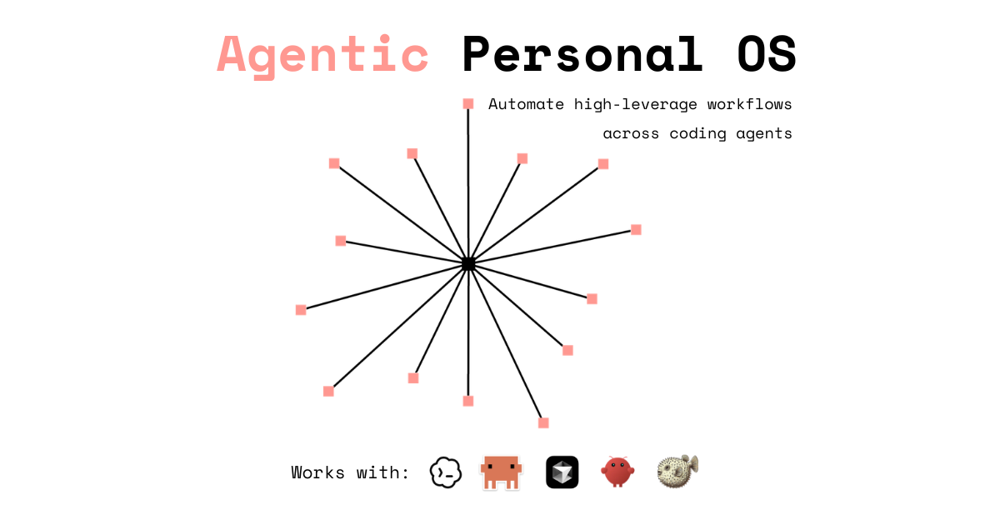
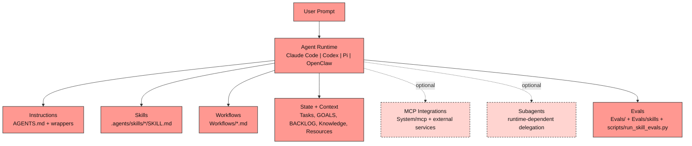

**TL;DR**: An agentic personal operating system built to automate high-leverage workflows across Claude Code, Codex, Pi, OpenClaw, and other coding agents/runtime platforms.

---

## Quick Start

1. **Clone this repo**
   ```bash
   git clone https://github.com/itseffi/personal-os.git
   cd personal-os
   ```

2. **Run setup**
   ```bash
   chmod +x setup.sh
   ./setup.sh
   ```

3. **Start using**
   This automates high-leverage execution end-to-end: it converts raw backlog into prioritized, goal-aligned, verification-enforced action plans.
   ```
   Open this repo in your agent and run:
   1) "Process my backlog from BACKLOG.md into Tasks/**/*.md using AGENTS.md rules."
   2) "Show my P0/P1 unblocked tasks aligned to GOALS.md."
   3) "Propose today’s top 3 with required verification evidence and commands."
   ```

---

## Quick Links

[Build Your Personal OS](Tutorials/build-your-personal-os.md) · [Workflows](Workflows/README.md) · [Canonical Skills](.agents/skills/README.md) · [Evals](Evals/README.md) · [Tutorials (index)](Tutorials/README.md)

---

## Architecture



---

## Agent Compatibility

Personal OS is designed to work with Claude Code, Codex, Pi, and OpenClaw.

- Shared behavior: `AGENTS.md`
- Claude wrapper: `CLAUDE.md`
- Codex wrapper: `CODEX.md`
- Pi wrapper: `PI.md`
- OpenClaw wrapper: `OPENCLAW.md`
- Canonical runtime skills: `.agents/skills/*/SKILL.md`
- Skills in this repo follow the [Agent Skills open standard](https://agentskills.io/home).
- This repo uses skills with progressive disclosure to manage context efficiently: agents begin with each skill's metadata (`name`, `description`, file path, plus `agents/openai.yaml`), and load full `SKILL.md` instructions only when a skill is selected. Canonical skills live in `.agents/skills/`, with bridge paths for Claude, Pi, and OpenClaw.
- Optional subagents are supported when the runtime provides agent delegation features (not required for core repo operation).
- Claude bridge path: `.claude/skills -> ../.agents/skills` (symlink)
- Pi bridge: configure Pi to point to this repo and use `.agents/skills/` as its skill source
- OpenClaw bridge: create `skills -> .agents/skills` symlink (or load `.agents/skills` via OpenClaw config)

Bridge bootstrap (run once from repo root):

```bash
mkdir -p .claude
ln -sfn ../.agents/skills .claude/skills
ln -sfn .agents/skills skills
```

For Codex/OpenAI-style routing metadata, this repo includes:
- `.agents/skills/<skill>/agents/openai.yaml`
  (Claude, Pi, and OpenClaw primarily use `SKILL.md` and do not require this file format.)

---

## Pi Local/Offline Setup (Optional)

You can run Personal OS with Pi using a local/offline model backend (for example `llama.cpp`) or a hosted endpoint. For full setup instructions (server launch, `~/.pi/agent/models.json`, and runtime configuration), see [Pi Agent Setup](Tutorials/pi-agent-setup.md).

---

## File System Layout

```
personal-os/
├── AGENTS.md           # AI agent instructions (the brain)
├── GOALS.md            # Your goals and priorities
├── BACKLOG.md          # Quick capture inbox
├── Tasks/              # Your active work
├── Knowledge/          # Your notes and docs
├── Resources/          # Voice samples, templates, references
├── Workflows/          # Daily + Product & Strategy workflows
├── .agents/skills/     # Canonical Codex/OpenAI skill packs
├── Evals/              # Session reviews
├── Tutorials/          # Learning guides
└── System/             # MCP server, templates, integrations
```

Semantics by location: `Tasks/*.md` = actionable work, `Knowledge/*.md` = reference context.

---

## How It Works

### The Memory Stack

```
AGENTS.md        →    Instructions layer (how AI behaves)
GOALS.md         →    Priority layer (what matters)
Tasks/**/*.md     →    State layer (current work)
Knowledge/**/*.md →    Context layer (reference)
.agents/skills/* →    Capability layer (how the agent executes specialized workflows)
```

### Privacy First

Personal operating data stays local (gitignored):
- `Tasks/` - your work
- `Knowledge/` - your notes
- `Resources/` - your samples
- `BACKLOG.md` - your inbox

Some top-level configuration files (`AGENTS.md`, `GOALS.md`, `CLAUDE.md`, `CODEX.md`, `PI.md`, `OPENCLAW.md`, docs) are version controlled by design. Treat `GOALS.md` as potentially sensitive and review content before publishing a public repo.

---


## Evals

This repo includes structural, behavioral, routing, and memory-impact evals.

Run:

```bash
python scripts/validate_skills.py
python scripts/validate_skill_eval_cases.py
python scripts/run_skill_evals.py --provider fixture
python scripts/run_routing_evals.py
python scripts/run_memory_impact_evals.py
```

Optional live-model run (OpenAI-compatible endpoint, local or remote):

```bash
python scripts/run_skill_evals.py --provider openai --model your-model-id
```

Outputs are written to:

- `Evals/skills/results/`
- `Evals/memory/results/`

Use these evals as a regression gate when updating `.agents/skills/`.

---

## Long-Running Agent Principles

Personal OS follows four operating patterns:
- **Skills**: versioned procedures in `.agents/skills/*/SKILL.md`
- **Shell execution**: run real tasks in terminal environments and produce artifacts
- **Compaction-aware workflows**: structure long runs to preserve continuity
- **Verification-first completion**: require fresh evidence before claiming work is done

Security defaults:
- Keep network access minimal and allowlist-based
- Treat tool output as untrusted input
- Use explicit review boundaries for generated artifacts

---

## Tech Stack

- **File Format:** Markdown with YAML frontmatter
- **Agent Runtimes:** Claude Code, Codex, Pi, OpenClaw, Cursor, and similar coding agent runtimes
- **Optional Integrations:** MCP (Slack, Linear, Google Calendar, Atlassian, Granola)
- **Version Control:** Git

---

## Contributing

Issues and PRs welcome.
